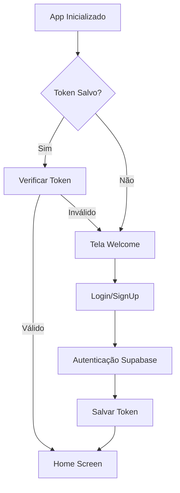
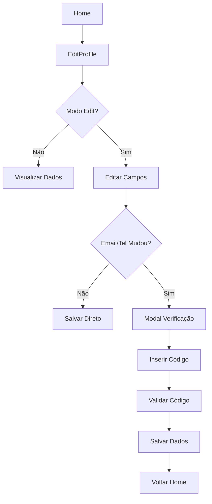
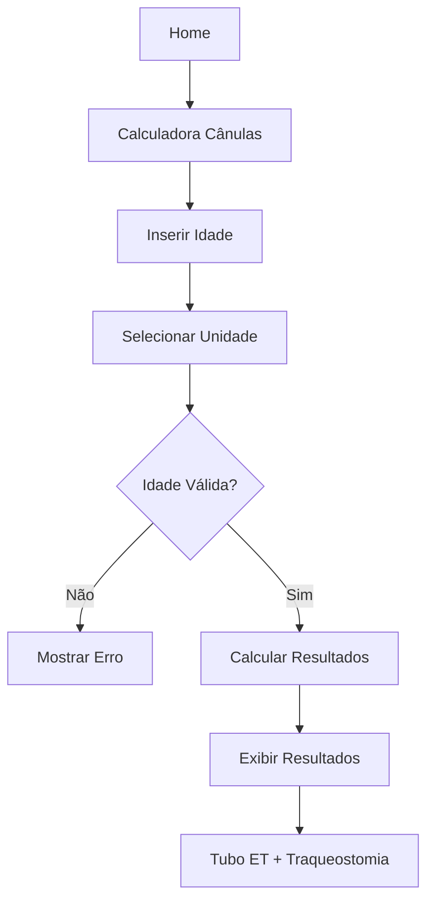

# 📱 VapApp - Documentação Completa

## 📋 Índice

1. [Visão Geral](#visão-geral)
2. [Arquitetura do Sistema](#arquitetura-do-sistema)
3. [Funcionalidades Implementadas](#funcionalidades-implementadas)
4. [Estrutura de Arquivos](#estrutura-de-arquivos)
5. [Componentes UI](#componentes-ui)
6. [Telas (Screens)](#telas-screens)
7. [Serviços](#serviços)
8. [Sistema de Navegação](#sistema-de-navegação)
9. [Gerenciamento de Estado](#gerenciamento-de-estado)
10. [Sistema de Autenticação](#sistema-de-autenticação)
11. [Design System](#design-system)
12. [Fluxos de Usuário](#fluxos-de-usuário)
13. [Configuração e Deploy](#configuração-e-deploy)

---

## 🎯 Visão Geral

**VapApp** é um aplicativo móvel React Native desenvolvido para pais e cuidadores de crianças com necessidades médicas especiais. O aplicativo oferece:

- Portal centralizado para gestão de cuidados
- Calculadoras médicas especializadas
- Sistema de perfil completo com verificação
- Interface intuitiva e mobile-first

### 🚀 Stack Tecnológica

- **Frontend**: React Native + Expo (~54.0.9)
- **Linguagem**: TypeScript (strict mode)
- **Backend**: Supabase (Auth, Database, Storage)
- **Navegação**: React Navigation v7
- **Estado**: Zustand
- **Formulários**: React Hook Form + Yup
- **Estilização**: StyleSheet nativo

---

## 🏗️ Arquitetura do Sistema

### Padrão de Arquitetura

O projeto segue uma arquitetura **Component-Based** com separação clara de responsabilidades:

```
📦 Apresentação (Screens + Components)
├── 🎨 UI Components (Reutilizáveis)
├── 🧩 Common Components (Lógica de negócio)
└── 📱 Screens (Páginas da aplicação)

📦 Lógica de Negócio (Services + Stores)
├── 🔧 Services (APIs externas)
└── 🗄️ Stores (Estado global)

📦 Infraestrutura (Utils + Types)
├── 🛠️ Utils (Funções auxiliares)
└── 📝 Types (Definições TypeScript)
```

### Princípios Arquiteturais

1. **Single Responsibility**: Cada componente tem uma responsabilidade única
2. **Reusability**: Componentes máximamente reutilizáveis
3. **Type Safety**: TypeScript em modo strict
4. **Mobile-First**: UX otimizada para dispositivos móveis

---

## ✨ Funcionalidades Implementadas

### 🏠 Portal Principal
- **HomeScreen**: Interface principal para pais e cuidadores
- **Seções Organizadas**: Gestão de cuidados, Suporte, Recursos
- **ProfileCard**: Exibição do perfil do usuário
- **Navegação Intuitiva**: Acesso rápido às funcionalidades

### 👤 Sistema de Perfil
- **Modo Read/Edit**: Alternância entre visualização e edição
- **Upload de Foto**: Câmera ou galeria com Expo Image Picker
- **Verificação de Email**: Deep linking com Supabase Auth
- **Verificação de Telefone**: Sistema de SMS (em desenvolvimento)
- **Máscaras de Input**: Telefone brasileiro formatado
- **Validação em Tempo Real**: React Hook Form + Yup

### 🧮 Calculadora Médica
- **Cânula de Traqueostomia**: Cálculos precisos baseados em idade
- **Interface Intuitiva**: Seletor de unidade (anos/meses)
- **Validação Rigorosa**: Apenas números inteiros
- **Resultados Detalhados**: Tubo ET, Traqueostomia, Broncoscopia
- **UX Mobile**: KeyboardAvoidingView e layouts responsivos

### 🔐 Sistema de Autenticação
- **Login/Signup**: Fluxo completo com Supabase Auth
- **Recuperação de Senha**: Reset por email com deep linking
- **Persistência Segura**: Expo Secure Store
- **Estado Global**: Zustand store tipado

### 📝 Sistema de Cadastro de Crianças
- **Formulário Completo**: 8 seções navegáveis com dados médicos e familiares
- **Validação por Seção**: React Hook Form + Yup com validação progressiva
- **Persistência de Dados**: Dados salvos entre navegações das seções
- **Integração Supabase**: Salvamento automático no banco de dados
- **Campos Avançados**: 50+ campos incluindo arrays e dados médicos complexos
- **APIs Integradas**: IBGE (estados/cidades) e ViaCEP (endereços)
- **UX Profissional**: Barra de progresso, animações suaves, feedback visual

### 🗄️ Integração com Banco de Dados
- **Supabase PostgreSQL**: Banco principal com Row Level Security (RLS)
- **Tabela `children`**: 55+ campos para dados completos das crianças
- **Service Layer**: `childrenService` para CRUD completo
- **Validações**: Checks constraints, campos obrigatórios, tipos específicos
- **Segurança**: Políticas RLS garantindo isolamento por usuário
- **Performance**: Índices otimizados para buscas e relatórios
- **Auditoria**: Triggers automáticos para created_at/updated_at

---

## 📁 Estrutura de Arquivos

### `/src/components/`

#### `/ui/` - Componentes Base
```typescript
├── Button.tsx          # Botão reutilizável com variantes
├── Input.tsx           # Campo de entrada com validação
├── Typography.tsx      # Sistema de tipografia padronizado
├── Toast.tsx           # Notificações temporárias
├── ReadOnlyField.tsx   # Campo não editável estilizado
└── index.ts           # Barrel export
```

#### `/common/` - Componentes de Negócio
```typescript
├── Header.tsx          # Header padrão com botão voltar
├── ProfileCard.tsx     # Card de perfil do usuário
├── SectionCard.tsx     # Card de seção com título
├── ActionButton.tsx    # Botão de ação com ícone
├── ResourceGrid.tsx    # Grid de recursos em 2 colunas
├── VerificationModal.tsx # Modal de verificação de código
└── index.ts           # Barrel export
```

#### `/calculators/` - Calculadoras Médicas
```typescript
├── TraqueostomiaCalculator.tsx # Calculadora de cânula
└── index.ts                   # Barrel export
```

### `/src/screens/`

#### Telas de Autenticação (`/auth/`)
```typescript
├── WelcomeScreen.tsx      # Tela de boas-vindas
├── LoginScreen.tsx        # Login do usuário
├── SignUpScreen.tsx       # Cadastro de novo usuário
├── ForgotPasswordScreen.tsx # Recuperação de senha
├── ResetPasswordScreen.tsx  # Reset de senha
└── index.ts              # Barrel export
```

#### Telas Principais
```typescript
├── HomeScreen.tsx           # Portal principal
├── EditProfileScreen.tsx    # Edição de perfil
├── TraqueostomiaScreen.tsx  # Calculadora de cânulas
├── EmailUpdatedScreen.tsx   # Confirmação de email
└── index.ts                # Barrel export
```

### `/src/services/`

#### `/auth/` - Serviços de Autenticação
```typescript
├── authService.ts      # Abstração das operações de auth
└── index.ts           # Barrel export
```

#### `/children/` - Serviços de Cadastro de Crianças
```typescript
├── childrenService.ts  # CRUD completo para dados das crianças
└── index.ts           # Barrel export
```

#### `/supabase/` - Configuração Supabase
```typescript
├── client.ts          # Cliente Supabase configurado
└── index.ts          # Barrel export
```

### `/src/stores/`
```typescript
├── authStore.ts       # Estado global de autenticação
└── index.ts          # Barrel export
```

### `/src/navigation/`
```typescript
├── AppNavigator.tsx   # Navegador principal
└── index.ts          # Barrel export
```

### `/src/utils/`
```typescript
├── constants/
│   ├── colors.ts      # Paleta de cores
│   ├── fonts.ts       # Tipografia
│   ├── sizes.ts       # Tamanhos e espaçamentos
│   └── index.ts       # Barrel export
└── index.ts          # Barrel export
```

---

## 🎨 Componentes UI

### Button Component
```typescript
interface ButtonProps {
  title: string;
  onPress: () => void;
  variant?: 'primary' | 'secondary' | 'outline';
  size?: 'small' | 'medium' | 'large';
  fullWidth?: boolean;
  loading?: boolean;
  disabled?: boolean;
  style?: ViewStyle;
}
```

**Uso:**
```typescript
<Button
  title="Salvar"
  onPress={handleSave}
  variant="primary"
  fullWidth
  loading={isLoading}
/>
```

### Input Component
```typescript
interface InputProps {
  placeholder?: string;
  value: string;
  onChangeText: (text: string) => void;
  keyboardType?: KeyboardTypeOptions;
  secureTextEntry?: boolean;
  multiline?: boolean;
  maxLength?: number;
  style?: TextStyle;
  error?: string;
}
```

**Uso:**
```typescript
<Input
  placeholder="Digite sua idade"
  value={idade}
  onChangeText={setIdade}
  keyboardType="number-pad"
  error={errors.idade}
/>
```

### Typography Component
```typescript
interface TypographyProps {
  variant: 'h1' | 'h2' | 'h3' | 'body' | 'caption' | 'subtitle';
  children: React.ReactNode;
  style?: TextStyle;
  numberOfLines?: number;
}
```

**Uso:**
```typescript
<Typography variant="h1" style={{ color: 'red' }}>
  Título Principal
</Typography>
```

---

## 📱 Telas (Screens)

### HomeScreen.tsx
**Propósito**: Portal principal para pais e cuidadores

**Componentes principais:**
- `ProfileCard`: Exibe informações do usuário
- `SectionCard`: Organiza funcionalidades por categoria
- `ActionButton`: Botões de ação rápida
- `ResourceGrid`: Grid de recursos em 2 colunas

**Estado local:**
```typescript
const { user, signOut } = useAuthStore();
const navigation = useNavigation<HomeScreenNavigationProp>();
```

**Seções:**
1. **Gestão de cuidados**: Cadastrar crianças, Calculadora de cânulas
2. **Suporte**: Tirar dúvidas, Agendar consultas
3. **Recursos**: Aulas, Quiz, E-books, Mercado

### EditProfileScreen.tsx
**Propósito**: Edição completa do perfil do usuário

**Funcionalidades:**
- **Modo Read/Edit**: Toggle entre visualização e edição
- **Upload de Foto**: Integração com câmera/galeria
- **Verificação de Email/Telefone**: Modais de verificação
- **Validação em Tempo Real**: React Hook Form + Yup
- **UX Mobile**: KeyboardAvoidingView para teclado

**Estado principal:**
```typescript
const [isEditMode, setIsEditMode] = useState(false);
const [avatarUri, setAvatarUri] = useState<string | null>(null);
const [showVerificationModal, setShowVerificationModal] = useState(false);
```

**Fluxo de verificação:**
1. Usuário edita email/telefone
2. Sistema solicita verificação
3. Modal de código é exibido
4. Código é validado via Supabase
5. Dados são atualizados

### TraqueostomiaScreen.tsx
**Propósito**: Calculadora médica de cânula de traqueostomia

**Componentes:**
- `Header`: Header padrão com botão voltar
- `TraqueostomiaCalculator`: Lógica de cálculo

**Funcionalidades do calculator:**
- **Input de Idade**: Validação para números inteiros
- **Seletor de Unidade**: Toggle anos/meses
- **Cálculos Precisos**: Baseados em fórmulas pediátricas
- **Resultados Detalhados**: Tubo ET (ID/OD), Traqueostomia

### RegisterChildScreen.tsx
**Propósito**: Tela principal para cadastro completo de crianças com traqueostomia

**Componentes:**
- `Header`: Header padrão com botão voltar
- `ChildRegistrationForm`: Formulário multi-seção completo
- `Toast`: Feedback visual de sucesso/erro

**Funcionalidades principais:**
- **8 Seções Navegáveis**: Dados da criança, responsáveis, gestação, clínica, médico, cuidados, suporte, observações
- **Validação Progressiva**: Usuário só avança se completar campos obrigatórios da seção atual
- **Persistência Entre Seções**: Dados salvos automaticamente durante navegação
- **Integração APIs**: IBGE para estados/cidades, ViaCEP para endereços via CEP
- **Salvamento Supabase**: Integração completa com childrenService para persistência
- **Feedback Profissional**: Toasts, alerts, loading states e mensagens de erro específicas
- **50+ Campos**: Incluindo arrays, campos condicionais, dropdowns modais e validações médicas

**Fluxo de salvamento:**
1. Usuário preenche todas as 8 seções
2. Sistema consolida dados de todas as seções
3. Dados são transformados para formato do banco
4. childrenService.createChild() salva no Supabase
5. Feedback de sucesso/erro é exibido
6. Usuário retorna ao portal principal

---

## 🔧 Serviços

### authService.ts
**Propósito**: Abstração das operações de autenticação

**Principais métodos:**
```typescript
interface AuthService {
  // Autenticação básica
  signUp(email: string, password: string, userData: any): Promise<AuthResult>;
  signIn(email: string, password: string): Promise<AuthResult>;
  signOut(): Promise<void>;

  // Gestão de usuário
  getCurrentUser(): Promise<User | null>;
  updateProfile(data: UpdateProfileData): Promise<UpdateResult>;

  // Verificação
  sendEmailVerification(email: string): Promise<VerificationResult>;
  verifyEmailCode(token: string): Promise<boolean>;
  sendPhoneVerification(phone: string): Promise<VerificationResult>;
  verifyPhoneCode(phone: string, code: string): Promise<boolean>;

  // Utilitários
  onAuthStateChange(callback: AuthCallback): AuthSubscription;
}
```

**Configuração de Deep Linking:**
```typescript
const redirectTo = __DEV__
  ? 'exp://192.168.0.4:8081/--/email-updated'
  : 'vapapp://email-updated';
```

---

## 🧭 Sistema de Navegação

### AppNavigator.tsx
**Estrutura de navegação:**

```typescript
export type RootStackParamList = {
  // Auth Flow
  Welcome: undefined;
  Login: undefined;
  SignUp: undefined;
  ForgotPassword: undefined;
  ResetPassword: undefined;

  // Main App
  Home: undefined;
  EditProfile: undefined;
  Traqueostomia: undefined;
  EmailUpdated: undefined;
};
```

**Navegação condicional:**
```typescript
{isAuthenticated ? (
  // Telas autenticadas
  <>
    <Stack.Screen name="Home" component={HomeScreen} />
    <Stack.Screen name="EditProfile" component={EditProfileScreen} />
    <Stack.Screen name="Traqueostomia" component={TraqueostomiaScreen} />
  </>
) : (
  // Telas de autenticação
  <>
    <Stack.Screen name="Welcome" component={WelcomeScreen} />
    <Stack.Screen name="Login" component={LoginScreen} />
    <Stack.Screen name="SignUp" component={SignUpScreen} />
  </>
)}
```

**Deep Linking configurado:**
```typescript
const linking = {
  prefixes: ['vapapp://', 'exp://', 'exps://'],
  config: {
    screens: {
      ResetPassword: 'reset-password',
      EmailUpdated: 'email-updated',
    },
  },
};
```

---

## 🗄️ Gerenciamento de Estado

### authStore.ts (Zustand)
**Estrutura do store:**

```typescript
interface AuthState {
  // Estado
  user: User | null;
  isAuthenticated: boolean;
  isLoading: boolean;

  // Ações
  login: (user: User) => void;
  logout: () => void;
  updateUser: (userData: Partial<User>) => void;
  checkAuth: () => Promise<void>;
}
```

**Implementação:**
```typescript
export const useAuthStore = create<AuthState>((set, get) => ({
  user: null,
  isAuthenticated: false,
  isLoading: true,

  login: (user) => set({ user, isAuthenticated: true }),
  logout: () => set({ user: null, isAuthenticated: false }),
  updateUser: (userData) => set((state) => ({
    user: state.user ? { ...state.user, ...userData } : null
  })),

  checkAuth: async () => {
    const user = await authService.getCurrentUser();
    set({ user, isAuthenticated: !!user, isLoading: false });
  }
}));
```

---

## 🔐 Sistema de Autenticação

### Fluxo de Autenticação

1. **Inicialização**: `checkAuth()` verifica token salvo
2. **Login/Signup**: Credenciais enviadas ao Supabase
3. **Persistência**: Token salvo no Expo Secure Store
4. **Estado Global**: Zustand store atualizado
5. **Navegação**: Redirecionamento automático

### Verificação de Email

```typescript
// 1. Usuário inicia verificação
const result = await authService.sendEmailVerification(newEmail);

// 2. Email enviado com deep link
// Link: vapapp://email-updated?token=xyz

// 3. App processa deep link
useEffect(() => {
  const { data: authListener } = authService.onAuthStateChange(
    async (event, session) => {
      if (event === 'USER_UPDATED') {
        // Usuário confirmou email
        updateUser(session.user);
      }
    }
  );
}, []);
```

### Segurança

- **Expo Secure Store**: Armazenamento criptografado de tokens
- **Row Level Security**: Políticas RLS no Supabase
- **Validação Client-Side**: React Hook Form + Yup
- **Sanitização**: Validação de inputs

### childrenService.ts
**Propósito**: Service layer completo para gerenciamento de dados das crianças

**Principais métodos:**
```typescript
interface ChildrenService {
  // CRUD básico
  createChild(formData: ChildFormData): Promise<ServiceResult<Child>>;
  getChildren(): Promise<ServiceResult<Child[]>>;
  getChildById(childId: string): Promise<ServiceResult<Child>>;
  updateChild(childId: string, formData: ChildFormData): Promise<ServiceResult<Child>>;
  deleteChild(childId: string): Promise<ServiceResult<void>>;
}
```

**Funcionalidades:**
- **Transformação de Dados**: Converte dados do formulário para formato do banco automaticamente
- **Validações Rigorosas**: Nome obrigatório, data válida, SUS com 15 dígitos
- **Prevenção de Duplicatas**: Verificação de SUS já cadastrado para o usuário
- **Compatibilidade**: Popula campos antigos (name, birth_date) para retrocompatibilidade
- **Logs Detalhados**: Debug logs para desenvolvimento com prefixo [ChildrenService]
- **Tratamento de Erros**: Mensagens específicas para diferentes tipos de erro

**Transformações principais:**
```typescript
// Formato do formulário → Formato do banco
nomeCompleto → nome_completo + name (compatibilidade)
dataNascimento (DD/MM/YYYY) → data_nascimento (YYYY-MM-DD) + birth_date
numeroSUS → numero_sus (limpo, só dígitos)
pesoNascer → peso_nascer (convertido para integer)
// + 50 outros campos com transformações específicas
```

**Segurança integrada:**
- **RLS Automático**: Todas as queries respeitam Row Level Security
- **Isolamento por Usuário**: Apenas dados do usuário autenticado são acessíveis
- **Validação Dupla**: Client-side (formulário) + server-side (database constraints)

---

## 🎨 Design System

### Paleta de Cores

```typescript
export const Colors = {
  // Cor principal da marca
  vapapp: {
    teal: '#2A7F7E', // Verde principal
  },

  // Cores primárias
  primary: {
    50: '#f0fdfa',
    100: '#ccfbf1',
    // ... escala completa
    600: '#0d9488',
  },

  // Cores neutras
  neutral: {
    0: '#ffffff',    // Branco
    50: '#f9fafb',   // Cinza muito claro
    100: '#f3f4f6',  // Cinza claro
    // ... escala completa
    800: '#1f2937',  // Cinza escuro
    900: '#111827',  // Quase preto
  },

  // Cores de texto
  text: {
    primary: '#1f2937',
    secondary: '#6b7280',
    inverse: '#ffffff',
  }
};
```

### Tipografia

```typescript
export const Typography = {
  h1: { fontSize: 32, fontWeight: '700' },
  h2: { fontSize: 28, fontWeight: '600' },
  h3: { fontSize: 24, fontWeight: '600' },
  body: { fontSize: 16, fontWeight: '400' },
  caption: { fontSize: 14, fontWeight: '400' },
  subtitle: { fontSize: 18, fontWeight: '500' },
};
```

### Espaçamentos

```typescript
export const Sizes = {
  spacing: {
    xs: 4,
    sm: 8,
    md: 16,
    lg: 24,
    xl: 32,
  },
  radius: {
    sm: 4,
    md: 8,
    lg: 12,
    xl: 16,
  },
};
```

### Componente Header Padrão

**Design unificado:**
- Fundo verde (`Colors.vapapp.teal`)
- Ocupa toda a status bar (incluindo área da bateria/hora)
- Altura fixa com `paddingTop: 60px`
- Tipografia consistente

**Uso:**
```typescript
// Header simples
<Header title="Título da Página" />

// Header com navegação
<Header title="Editar Perfil" showBackButton />

// Header com elemento customizado
<Header
  title="Meu Perfil"
  showBackButton
  rightElement={<BotãoEditar />}
/>
```

---

## 👥 Fluxos de Usuário

### 1. Onboarding e Autenticação



### 2. Edição de Perfil



### 3. Calculadora Médica



---

## ⚙️ Configuração e Deploy

### Variáveis de Ambiente

```bash
# .env
EXPO_PUBLIC_SUPABASE_URL=your_supabase_url
EXPO_PUBLIC_SUPABASE_ANON_KEY=your_supabase_anon_key
```

### Scripts Package.json

```json
{
  "scripts": {
    "start": "expo start",
    "android": "expo start --android",
    "ios": "expo start --ios",
    "web": "expo start --web"
  }
}
```

### Dependências Principais

```json
{
  "dependencies": {
    "expo": "~54.0.9",
    "react-native": "0.81.4",
    "@supabase/supabase-js": "^2.x",
    "zustand": "^4.x",
    "@react-navigation/native": "^7.x",
    "react-hook-form": "^7.x",
    "yup": "^1.x",
    "expo-image-picker": "^15.x",
    "@react-native-picker/picker": "^2.x"
  }
}
```

### Configuração Supabase

> **📋 Documentação Completa**: Para detalhes completos da estrutura do banco de dados, consulte [DATABASE.md](./DATABASE.md)
>
> **🗄️ Script de Setup**: Para criar a estrutura no Supabase, execute [`docs/database/supabase-setup.sql`](./docs/database/supabase-setup.sql)

**Database Schema Principal:**
```sql
-- Tabela de usuários estendida
CREATE TABLE public.users (
  id UUID REFERENCES auth.users ON DELETE CASCADE,
  full_name TEXT,
  email TEXT,
  phone TEXT,
  avatar_url TEXT,
  created_at TIMESTAMP WITH TIME ZONE DEFAULT NOW(),
  updated_at TIMESTAMP WITH TIME ZONE DEFAULT NOW()
);

-- RLS Policies
ALTER TABLE public.users ENABLE ROW LEVEL SECURITY;

CREATE POLICY "Users can view own profile" ON public.users
  FOR SELECT USING (auth.uid() = id);

CREATE POLICY "Users can update own profile" ON public.users
  FOR UPDATE USING (auth.uid() = id);
```

**Storage Buckets:**
```sql
-- Bucket para avatars
INSERT INTO storage.buckets (id, name, public)
VALUES ('avatars', 'avatars', true);

-- Policy para upload de avatars
CREATE POLICY "Avatar upload policy" ON storage.objects
  FOR INSERT WITH CHECK (bucket_id = 'avatars' AND auth.uid()::text = (storage.foldername(name))[1]);
```

---

## 📊 Métricas e Performance

### Otimizações Implementadas

1. **Lazy Loading**: Componentes carregados sob demanda
2. **Memoization**: React.memo em componentes pesados
3. **Image Optimization**: Redimensionamento automático de avatars
4. **Bundle Splitting**: Separação por funcionalidade

### Monitoramento

- **Expo Analytics**: Métricas de uso integradas
- **Error Tracking**: Logs de erro estruturados
- **Performance**: React DevTools profiling

---

## 🔮 Próximos Passos

### Funcionalidades Planejadas

1. **Sistema de Notificações**: Push notifications
2. **Calculadoras Adicionais**: Mais ferramentas médicas
3. **Chat de Suporte**: Comunicação em tempo real
4. **Modo Offline**: Funcionamento sem internet
5. **Múltiplos Idiomas**: Internacionalização

### Melhorias Técnicas

1. **Testes Automatizados**: Jest + Testing Library
2. **CI/CD Pipeline**: GitHub Actions
3. **Code Splitting**: Otimização de bundle
4. **PWA Support**: Progressive Web App
5. **Acessibilidade**: WCAG compliance

---

**Documentação atualizada em**: Setembro 2025
**Versão do app**: 1.0.0
**Última revisão**: Sistema de calculadora médica implementado